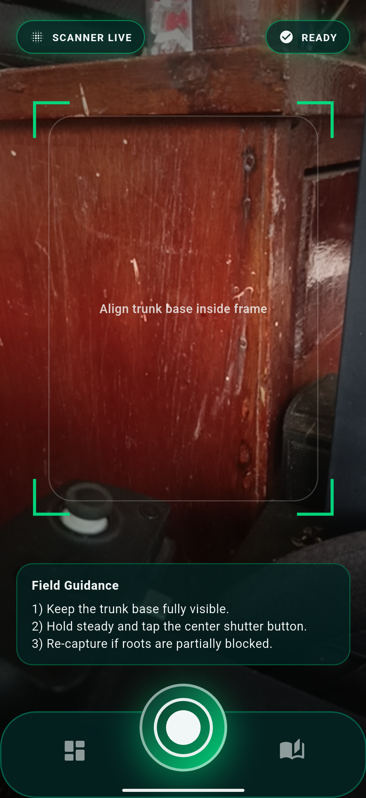
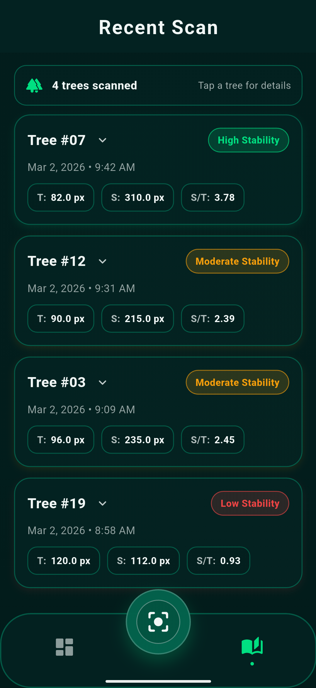
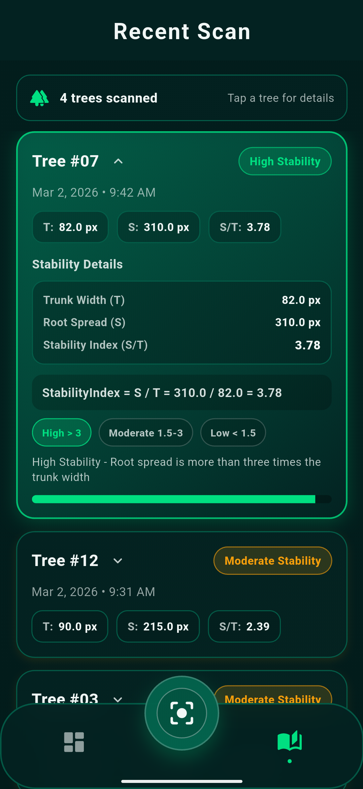

# Mangrove Guard App

Flutter mobile app for scanning mangrove trees, estimating root stability from on-device ML inference, tracking recent scans, and exporting PDF reports.

## Features

- On-device inference with a bundled TensorFlow Lite model (`assets/models/mangroveModel.tflite`).
- Camera-based capture flow with a guided scan frame.
- Stability assessment from root spread vs trunk width:
  - `High`: ratio `> 3.0`
  - `Moderate`: ratio `>= 1.5` and `<= 3.0`
  - `Low`: ratio `< 1.5`
- Dashboard metrics (total scans + distribution by stability class).
- Recent scan history with persisted local storage.
- PDF report export per scan (including highlighted root regions when available).
- Onboarding flow shown once, then skipped via local preference.

## Tech Stack

- Flutter / Dart (Dart SDK constraint: `^3.10.7`)
- `camera` for capture
- `tflite_flutter` for ML inference
- `shared_preferences` for local state/history
- `pdf` for report generation
- `path_provider` for local file storage

## Project Structure

```text
lib/
  main.dart
  features/
    onboarding/presentation/pages/onboarding_page.dart
    navigation/presentation/
      main_nav_page.dart
      metrics_page.dart
      recent_scan_page.dart
    home/
      presentation/pages/scanner_page.dart
      models/mangrove_tree.dart
assets/
  models/mangroveModel.tflite
  fonts/
images/
```

## Prerequisites

- Flutter SDK installed and configured
- Android Studio and/or Xcode (for device builds)
- Physical device recommended for camera testing

## Getting Started

```bash
flutter pub get
flutter run
```

## Useful Commands

```bash
# Static analysis
flutter analyze

# Run tests
flutter test

# Regenerate app icons
flutter pub run flutter_launcher_icons

# Regenerate splash screens
flutter pub run flutter_native_splash:create
```

## Platform Notes

- Android `minSdk` is `26` (`android/app/build.gradle.kts`).
- Camera permission is declared on Android and iOS.
- Android includes a native method channel (`mangroveguardapp/downloads`) to:
  - save exported PDFs to `Downloads/MangroveGuard`
  - open exported PDFs via chooser intent

## Data and Storage

- Onboarding completion flag: `showHome` in `SharedPreferences`
- Recent scans key: `recent_tree_scans_v1` in `SharedPreferences`
- Captured scan images are persisted under `scan_captures`
- Non-Android PDF fallback path is app-local `scan_exports`

## Screenshots





## Notes

- Measurement conversion currently uses a fixed `metersPerPixel` value (`0.003`) in the scan pipeline.
- Model parsing supports both mask-style and instance-style output tensors.
